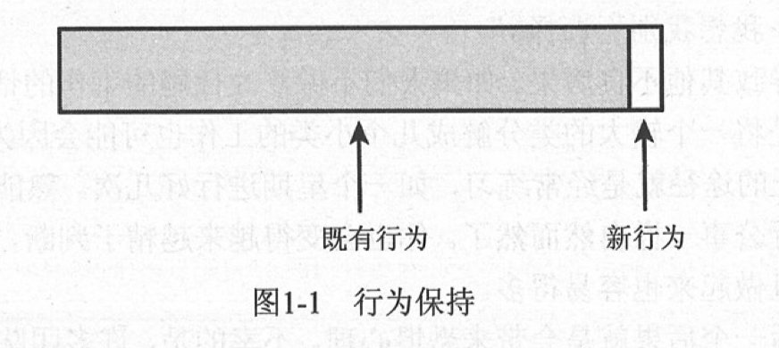

# 第1章 修改软件

修改（既有）代码本身并无什么问题，我们正是以此谋生的。然而，如果修改方式不当由会招来麻烦，当然，只要方法正确，我们也可以令事情变得简单的多。在业界，对于修改代码的方法学讨论得不是很多，其中最接近的恐怕是重构方面的文献了。因此我觉得可以将讨论的范畴稍微扩大一点，即讨论如何在最为棘手的情况下处理代码。为此，我们首先要深入了解修改的深层机理。

## 1.1 修改软件的四个起因

为了简明起见，让我们来看看修改软件的四个主要起因：

1. 添加新特性；
2. 修正bug；
3. 改善设计；
4. 优化资源使用

### 1.1.1 添加特性和修正bug

添加特性看起来似乎是最直接的一种改动：软件原先是以某种方式动作的，现在用户提出需要这个系统能够做其他事情。

假设我们正在构建一个基于WEB的应用，这时经理告诉我们她（指客户）想要把公司的logo从页面的左侧移到右侧。于是我们与她交谈，发现这件事情并不是想象中那么简单。她不但要移动logo，还想进行其他改动。她危房在系统的下一个版本中能够让它动起来。那么，这算是修正bug还是添加新特性呢？答案取决于看待这个问题的角度。从客户的角度来看，她很明显是在要求我们修正一个问题。因为不久前预览了网站，然后召集其部门的人员举行了一个会议，最后大家决定改动logo的位置，并要求更多一点的功能。而站在开发者的立场上，这种改动则可以看成是添加一个全新的特性。开发者会说：“如果客户不改变主要的话，我们的工作现在就已经算是完成了。”然而，对于某些公司，移动logo的位置只是看作bug修正，他们并不管开发团队为此而不得不从头开始做一些并工作的事实。

我们可以认为以上这些纯属主观看法的差异：在你的眼里它是一次bug修正，而在我看来则是添加新特性，就这么简单。然而实际情况是，许多公司出于合同或质量方面的某些原因和目的，bug修正与特性添加是必须分开记录和解决的。从的人层面来看，我们可以在：我们是在添加特性还是在修正bug”这个问题上争论不休。然而从代码层面来说，这些终究不过是在修改代码以及其他遗留下来的东西罢了。不幸的是，这种关于究竟是bug修正还是特性添加的争执掩盖了某些从技术上来说对我们要重要得多的东西：行为改变。事实上，在添加新行为与改变旧行为之间还在着巨大的差异。

> 行为对于软件来说是最重要的一样东西。软件的用户要依赖于软件的行为。用户喜欢我们添加行为（前提是新的行为确实是他们气需要的），然而如果我们改变或移除了他们原本所依赖的行为（引入bug），那么他们就不会再相信我们。

回过头来，在前面提到的logo案例中，我们是在添加新行为吗？是的。因为在发动之后，系统将在在页面的右侧显示logo。那么我们是否移除掉了某些行为呢？是的，因为页面的左侧将不会再有logo。

让我们再来看一个更为复杂的案例。假设客户想要在再现的右侧添加一个logo，同时在页面原本并没有任何logo。在这种情况下我们就是在添加新行为，但我们有没有移除任何已有行为呢？我们即将要放置logo的地方原本是否是由其他图案或文字占据呢？

我们是在改变行为，添加行为，还是两者皆是？

事实上，我们可以抽出一个对于程序员来说更为有用的差别。即如果我们必须修改代码（HTML某种程度上也算代码），那么我们就是在改变行为。如果我们只是往其中添加代码并调用它，则通常是在添加行为。对此我们再来看一个例子。下面是一个Java类的方法：

```java
public class CDPlayer{
  public void addTrackListing(Track track){
    ....
  }
  ...
}
```

该类拥有一个方法addTrackListing，我们通过该方法能够添加音轨列表。现在，让我们添加一个用于替换音轨列表的新方法：

```java
public class CDPlayer{
  public void addTrackListing(Track track){
    ....
  }
  public void replaceTrackListing(String name, Track track){
    ...
  }
  ...
}
```

当添加该方法时，我们是在往该应用程序中添加新行为呢，还是改变了现有行为？答案是：两者都不是。添加一个方法并不会改变代码的行为，除非我们以某种方式调用了该方法。

现在我们来进行另一处修改，往这个CD播放软件的用户界面上放置一个新的按钮。该按钮的功能是让用户能够替换音轨列表。这一举动不仅添加了replaceTrackListing方法气指定的行为，同时也细微地改变了该软件的行为。因为有了这个新按钮，用户界面的渲染（render）就与以前不一样了，用户界面的显示大概需要多耗一毫秒（用于渲染新的按钮）。所以，想要完全不改变现有行为地添加新行为几乎是不可能的。

### 1.1.2 改善设计

改善设计则是另一种软件修改。当我们想要改变既有软件的结构组织，以令其更易于维护时，通常也会危房能够在此过程中不改变其行为。倘若在这个过程中丢掉了某个行为，我们通常会将其称作引入了一个bug。许多程序员通常并不试图改善既有设计，其主要原因之一就是这一举动相对容易导致行为丧失或坏行为的诞生。

在不改变软件行为和前提下改善其设计的举动称为重构（refactoring）。重构背后的理念是，如果我们编写测试以确保现有行为不变，并在重构过程中的每一小步都小心验证其行为的不变性的话，我们就可以在不改变软件行为的前提下通过重构使其更具可维护性。多年来人们一直都在做着清理系统中既有代码的事情，而重构的出现则是近几年的事。重构与一般的代码清理不两只，在重构时我们并不只是在做那些低危险性的工作（如重整源代码的格式）或侵入性的危险工作（如重写代码块），而是进行一系列的结构上的小改动，并通过测试的支持来使得代码的修改理解容易着手。从改变的角度来说，重构的关键在于在进行重构的过程中不应当有任何功能上的改变。（不过行为可以稍有改变，因为你在代码结构上的改动可能会导致性能上的改变，其性能可能会变得差一点，也可能会变得好一点。）

### 1.1.3 优化

优化与重构类似，但目标不同。对于重构和优化，我们都可以说：“我们在进行修改的过程中将会保持功能不变，但我们可能会改变某些其他东西。”对于重构来说，这里的“某些其他东西”就是指程序的结构，我们想让代码更容易维护。而对于优化来说，“某些其他东西”则是指程序所使用的某些资源，通常指时间或内存。

### 1.1.4 综合起来

重构与优化的相似性看起来似乎有点奇怪。它们彼此间的相似性看上去比添加新特性与修正bug之间的相似性还要高。然而，真的是这样吗？重构与优化之间的共同点就是改变某些东西的过程中保持软件的功能不变。

一般而言，当对一个系统进行修改的时候，其三个方面可能发生改变：结构、功能以及资源使用。

让我们来看一看，当进行上述四种修改的时候，系统通常在哪些方面发生改变，以及哪些方面基本保持不变（通过其三个方面都会发生改变为，但让我们来看看什么是典型的情况）：

|          | 添加特性 | 修正bug | 重构 | 优化 |
| :------: | :------: | :-----: | :--: | :--: |
|   结构   |   改变   |  改变   | 改变 |  -   |
|   功能   |   改变   |  改变   |  -   |  -   |
| 资源使用 |    -     |    -    |  -   | 改变 |

从表面上看，重构和优化的确是蛮相似的。它们都保质功能不变。但倘若我们将新功能的出现分离出来考虑又会怎样呢？当我们添加一个新特性时，通常是在维持现有功能不变的前提下添加新的功能。

|          | 添加特性 | 修正bug | 重构 | 优化 |
| :------: | :------: | :-----: | :--: | :--: |
|   结构   |   改变   |  改变   | 改变 |  -   |
|  新功能  |   改变   |    -    |  -   |  -   |
|   功能   |    -     |  改变   |  -   |  -   |
| 资源使用 |    -     |    -    |  -   | 改变 |

添加特性、重构以及优化这三种举动统统都维持既有功能不变。如果仔细观察bug修正的话，我们会发现它是会改变（既有）功能的，只不过这种改变比起那些没被改变的既有功能通常显得非常小罢了。

特性添加和bug修正与重构和优化是非常相似的。在所有四种情况下，我们都想要改变某些功能、某些行为，但我们想要保持为变的地方则要多得多。



图1-1很好地表现了当对系统进行修改时所发生的情况，那么在实际工作中这幅图对我们来说又意味着什么呢？从积极的角度来说，这幅图似乎告诉我们应当将注意力集中在什么方面。我们要确保所修改的少数几处已经正确修改了。从消极的角度来说， 我们不仅需要关注这些，还得知道如何保持其他行为不变。然而遗憾的时，保留既有行为不变并非意味着只要不碰那些代码就成。我们要知道这些行为并没有发生改变，而这可能是件棘手的事情。需要保持的行为的数量通常是非常巨大的，不过这倒不是什么大问题。问题在于我们通常并不矢在修改的过程中哪些行为存在被连带改变的风险。如果我们知道，就可以将精力集中在那些行为上而不用管其他的。所以，要想安全地进行修改，关键就在于“理解”。

> 保留既有行为不变是软件开发中最具挑战性的任务之一。即便是在改变主要特性时，通常也有很多行为是必须保留不变的。

## 1.2 危险的修改

行为保持是一项巨大的挑战。在我们需要作出修改并保持行为时，往往伴随着相当大的风险。

为了减小风险，我们要考虑下面这三个问题：

1. 我们要进行哪些修改？
2. 我们如何得知已经正确地完成了修改？
3. 我们如何得知没有破坏任何）既有的）东西？

如果所作改动是有风险的话，你能够承担得起多少改动？

我曾共事过的大多数团队都曾试图以一种非常传统的方式来控制风险。他们把对代码基的改动数量降至最低。有时候这是一种团队策略；“如果没有被破坏，就别去修正。”开发者在进行修改的时候是非常谨慎的。“什么？为此创建一个新方法？不不不，我还是把这几行代码直接放到这个现成的方法里面算了，这样我就可以看到新老代码在一起。况且这种做法费力少，也更为安全。”

人们可能会认为可以通过“避免”二字诀来将软件问题的数量降至最低，然而遗憾的是，问题总是不可避免。当我们避免创建新类和新方法时，既有的类和方法就会变得越来越庞大，越来越难以理解。当在任何大型系统中进行修改时，你可能需要一点时间来熟悉一下将要修改的区域。这时好的系统和差的系统之间的差别就出来了。对于前者，当你熟悉了待修改的区域之后，你会对将要进行的修改充满信心。而对于那些消防安全糟糕的代码，从理清存在的问题到着手进行修改的过程简直就像是为了躲避一只老虎而跳下悬崖一样痛苦。你一再犹疑：“我真的准备好这么做了吗？唔，好吧，我想我别无选择。”

避免修改还会导致其他不良后果。如果人们不做修改代码的工作的话，久而久之他们就会对此感到生疏。即便是将一个较大的类分解成几个小类的工作也可能会因为生疏而变得棘手起来。要想保持熟练，唯一的途径就是经常练习，如一个星期进行好几次。熟能生巧之后，这件事情对你来说就变得像例行公事一样自然而然了。你也会变得越来越精于判断，知道哪些代码可以分解哪些则不可以，而且做起来也容易得多。

避免改动的最后一个后果就是会带来恐惧心理。不幸的是，许多团队都在忍受着很重的恐惧心理，而且每况愈下。通常他们并不知道他们的恐惧到底有多重，直到他们学到理解好的技术，而恐惧心理也随之减退。

我们已经讨论了，避免修改是不可取的做法，然而既然不能避免，那我们该怎么做呢？答案是我们应该更努力地去修改。或许我们可以雇佣更多的员工，这样每个人就会有足够的时间来进行分析，仔细审查所有的代码并“正确地”进行修改。更多的时间和详细审查应该会让修改变得更为安全。但果真如此吗？在所有的代码审查完毕之后，究竟有没有人确切知道他们是否把事情做对了呢？


